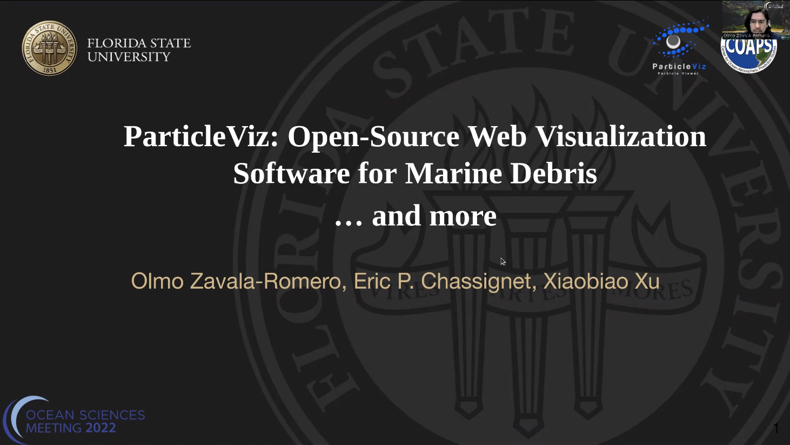

#   Welcome to ParticleViz  
ParticleViz is an Open Source software that is used to animate
large number of particles inside dynamic web maps.
It is designed mostly for Earth Science scientists
that simulate different processes using Lagrangian models.

The objectives of this software are:
* Provide efficient visualizations that can help analyze and understand research made
through lagrangian modelling in the Earth Sciences, in a fast and easy way. 
* Make it easy to share this research with other colleagues with selfcontained
websites. 

**ParticleViz** currently reads NetCDF outputs from [OceanParcels](https://oceanparcels.org/).

## Status


## Install
Classic steps:

1. Clone repository
2. Create conda environment with the proper dependencies
3. Enjoy life

```shell
git clone https://github.com/olmozavala/particleviz.git
cd particleviz
```

#### Anaconda
Create new environment from **yml** file and active it.
```shell
conda env create -f particleviz.yml
conda activate particleviz
```

## Quick Start

Once you have installed the [Python dependencies](#python-dependencies) and 
[JS dependencies](#js-dependencies-npm), then the simplest way to 
use **ParticleViz** is to run it specifying the input netcdf from
the command line directly (the netcdf file should have the format 
from [OceanParcels](https://oceanparcels.org/)).
You need to be patient the first time you run it because it will 
install all the Javascript dependencies. It will be much faster after that.
This will generate the *default* web interface to display your data.

```shell
python ParticleViz.py --input_file <path to netcdf> 
```

Test it with the *Global_Marine_Debris.nc* file inside the *ExampleData* folder with:

```shell
python ParticleViz.py --input_file ExampleData/Global_Marine_Debris.nc
```


## Intro video
This is a presentation made at OceanSciences meeting about ParticleViz in March 2022.

[](https://youtu.be/7Xk0DxRMPjQ?t=289)


## Advanced Configuration
For additional examples and a detailed documentation 
please visit [ParticleViz page](https://olmozavala.github.io/particleviz/).