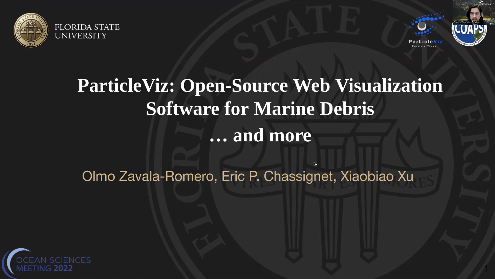

#   Welcome to ParticleViz  
ParticleViz is an Open Source software that is used to animate large number of particles inside dynamic web maps.
It is designed mostly for Earth Science scientists that simulate different processes using Lagrangian models.

The objectives of this software are:
* Provide efficient visualizations that can help analyze and understand research made through lagrangian modelling in the Earth Sciences, in a fast and easy way. 
* Make it easy to share this research with other colleagues with self-contained websites. 

**ParticleViz** reads particle trajectory data in **NetCDF** or **Zarr** format. Inputs from [OceanParcels](https://oceanparcels.org/) and [OpenDrift](https://opendrift.github.io/) are recognized automatically; any dataset that follows the same variable naming convention also works.

## Status


## Install

1. Clone the repository.

```shell
git clone https://github.com/olmozavala/particleviz.git
cd particleviz
```

2. Install [uv](https://docs.astral.sh/uv/getting-started/installation/) and create the Python environment.

```shell
# Linux / macOS (see uv docs for other platforms)
curl -LsSf https://astral.sh/uv/install.sh | sh

# Create .venv and install Python dependencies from pyproject.toml
uv sync
```

3. Install [Node.js](https://nodejs.org/) (LTS recommended). It is required for the React web app (`npm install` / `npm start`).

4. Enjoy life

### Python dependencies

All Python packages are listed in `pyproject.toml`. `uv sync` creates a local `.venv` in the project root.

Run ParticleViz through uv so the correct environment is used:

```shell
uv run python ParticleViz.py --help
```

To include development tools (pytest):

```shell
uv sync --extra dev
uv run pytest tests/
```

### Alternative: Conda

If you prefer conda, an environment file is still provided:

```shell
conda env create -f particleviz.yml
conda activate particleviz
```

## Quick Start

The simplest way to use **ParticleViz** is to pass a trajectory dataset from the command line (`.nc` NetCDF file or Zarr store directory):

```shell
uv run python ParticleViz.py --input_file <path_to_dataset>
```

Examples:

```shell
# NetCDF (OceanParcels / OpenDrift / convention-compatible)
uv run python ParticleViz.py --input_file ExampleData/Global_Marine_Debris.nc

# Zarr store directory
uv run python ParticleViz.py --input_file /path/to/output.zarr
```

This will generate the *default* web interface and store the parameters into a configuration file, `Current_Config.json`. It can be edited to customize the interface. You need to be _patient_ the first time you run it because it will install all the Javascript dependencies.


## Docker
You can run ParticleViz as a docker container. By default it will run using the example data files.
If you want to change the default permanently, edit `entrypoint.sh` before building the image.

1. Install Docker
2. `git clone https://github.com/olmozavala/particleviz.git`
3. `cd particleviz`
4. `docker build --pull --rm -f Dockerfile -t particleviz "."`
5. `docker run --rm -it -p 3000:3000 particleviz:latest`
6. Open `http://localhost:3000/`

See the [docs](https://olmozavala.github.io/particleviz/install.html#docker) for mounting your own datasets and config files.

## Intro video
This is a presentation made at OceanSciences meeting about ParticleViz in March 2022.

[](https://youtu.be/7Xk0DxRMPjQ?t=289)

## Docs
Please take a look at the complete docs at [https://olmozavala.github.io/particleviz/](https://olmozavala.github.io/particleviz/)
