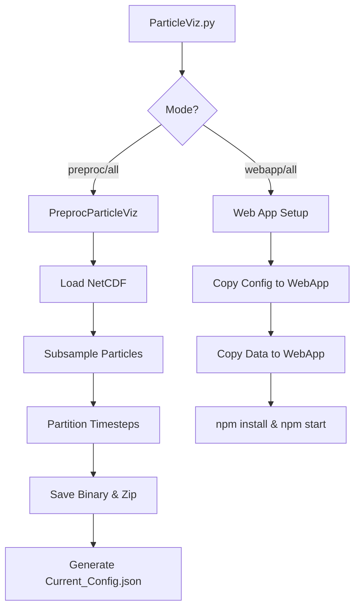

# ParticleViz Code Flow

ParticleViz is a tool designed to visualize Lagrangian particle data (e.g., from OceanParcels or OpenDrift) on the web. The process involves three main stages: Configuration, Preprocessing, and Web App Deployment.

## 1. Entry Point: `ParticleViz.py`
The main CLI tool uses `docopt` to handle different modes:
- `all`: Runs both preprocessing and web app setup.
- `preproc`: Runs only the preprocessing stage.
- `webapp`: Runs only the web app setup (assuming preprocessing is done).

## 2. Configuration Management
- **`ConfigParams.py`**: Defines default settings for both preprocessing and the web app.
- **Merge Logic**: User-provided configuration files are merged with the defaults recursively. This ensures that even a minimal config can be used, with the system filling in the blanks.
- **Dynamic Configuration**: If a user provides only a NetCDF file (`--input_file`), ParticleViz generates a temporary configuration on the fly.

## 3. Preprocessing: `PreprocParticleViz.py`
This is where the heavy lifting happens for data conversion.
- **Model Detection**: Automatically detects if the input file is from **OceanParcels** or **OpenDrift** based on NetCDF attributes and variable names.
- **Subsampling**: To ensure performance on different devices, it generates two versions of the data:
    - **Desktop**: A higher-resolution subsample.
    - **Mobile**: A lower-resolution subsample for better performance on mobile browsers.
- **Binary Conversion**:
    - Converts Lat/Lon coordinates into **16-bit integers** (scaled by 100) to minimize file size.
    - Partitions the data into chunks (default 50 timesteps per file).
    - Saves data in binary format (`.bin`) accompanied by a metadata header (`.txt`).
    - Zips the binary files (the web app expects `.zip` files).
- **Color Schemes**: If a specific color scheme is provided, `ColorByParticleUtils.py` adjusts the particle indexes in the scheme to match the subsampled data.

## 4. Web App Setup
- **`Current_Config.json`**: This file is generated during preprocessing and contains the final merged configuration, including paths to the generated data files.
- **Asset Deployment**:
    - `Current_Config.json` is copied to the web app's source folder as `Config.json`.
    - Generated data chunks are copied to the web app's `public/data` directory.
- **Server Initialization**:
    - Checks for `node_modules` and runs `npm install` if necessary.
    - Runs `npm start` to launch the React/Vite-based web application.

## Summary Diagram

